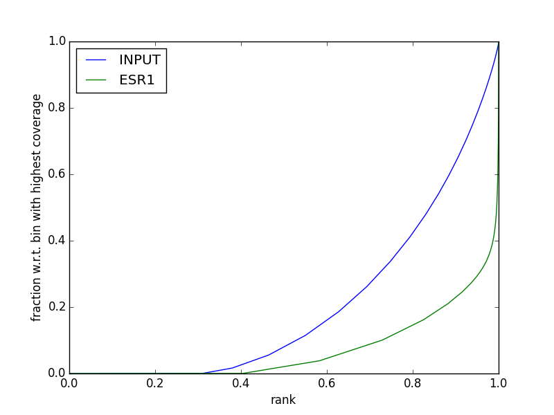

<style>
.imgContainer {
  overflow: hidden;
  width: 100px;
  height: 100px;
}
.imgContainer img {
  width: 100px;

}
</style>


## CHiP-Seq dataset description

<div class="imgContainer">
<a href ="https://www.ncbi.nlm.nih.gov/pubmed" > </a>
</div>

For this tutorial we will use CHiP-Seq datasets produced by [Theodorou *et al*](http://www.ncbi.nlm.nih.gov/pubmed/23172872). The authors used ChIP-Seq technology in order to systematically identify ESR1 binding regions across the human genome. Importantly, they demonstrated that knock-down of GATA3 through siRNA greatly affect ESR1 binding. The corresponding abstract of this article is provided below.

### Abstract

Estrogen receptor (ESR1) drives growth in the majority of human breast cancers by binding to regulatory elements and inducing transcription events that promote tumor growth. Differences in enhancer occupancy by ESR1 contribute to the diverse expression profiles and clinical outcome observed in breast cancer patients. GATA3 is an ESR1-cooperating transcription factor mutated in breast tumors; however, its genomic properties are not fully defined.

In order to investigate the composition of enhancers involved in estrogen-induced transcription and the potential role of GATA3, we
performed extensive ChIP-sequencing in unstimulated breast cancer cells and following estrogen treatment. We find that GATA3 is pivotal in mediating enhancer accessibility at regulatory regions involved in ESR1-mediated transcription. GATA3 silencing resulted in a global
redistribution of cofactors and active histone marks prior to estrogen stimulation. These global genomic changes altered the ESR1-binding
profile that subsequently occurred following estrogen, with events exhibiting both loss and gain in binding affinity, implying a
GATA3-mediated redistribution of ESR1 binding. The GATA3-mediated redistributed ESR1 profile correlated with changes in gene expression,
suggestive of its functionality. Chromatin loops at the TFF locus involving ESR1-bound enhancers occurred independently of ESR1 when GATA3 was silenced, indicating that GATA3, when present on the chromatin, may serve as a licensing factor for estrogen-ESR1-mediated interactions between cis-regulatory elements. Together, these experiments suggest that GATA3 directly impacts ESR1 enhancer accessibility, and may potentially explain the contribution of mutant-GATA3 in the heterogeneity of ESR1+ breast cancer.

------------------------------------------------------------------------

### Getting information about the experiment using the GEO and SRA websites

<div class="imgContainer">
<a href ="https://www.ncbi.nlm.nih.gov/sra" > </a>
</div>

Gene Expression Omnibus ([GEO](http://www.ncbi.nlm.nih.gov/geo/)) is a
public repository that provides tools to submit, access and mine
functional genomics data. Data may be related to array- or
sequence-based technologies. For HTS data, GEO provides both processed
data (such as \*.bam, \*.bed, \*.wig files) and links to raw data. Raw
data are available from the Sequence Read Archive
([SRA](http://trace.ncbi.nlm.nih.gov/Traces/sra/)) database (including
454, IonTorrent, Illumina, SOLiD, Helicos and Complete Genomics). Both
web sites propose search engines to query their databases.

<div class="protocol">

> - Go to [GEO web site](http://www.ncbi.nlm.nih.gov/geo/).
> - Choose "Search" and paste **GSE40129** (GSE stands for GEO Series Experiment). Click "GO" to get information about this experiment.
> -   In the "sample section" (middle of the page), click on **More** to visualize all sample names.
> -   Click on **GSM986059** hyperlink (GSM stands for GEO SaMple) to get information about this sample.
> -   In the "relations" section, select **SRX176856** hyperlink to open the SRA page corresponding to this sample.
> -   Click on the SRR link (bottom right) to access the record of the run.
> -   On the new page, click on the **Reads** tab to view the read sequence (you can display the quality clicking on Customize).
> -   From there, you might also download the dataset as a .sra file, but we **will not do it in the context of this practical** (beware, this would take time and occupy disk space, since SRA files typically weight several hundred Mb !).

</div>

**NB**: SRA file are not always very convenient as they required to be "dumped" into fastq file format. One can also download sequencing data from [ENA (European Nucleotide Archive)](http://www.ebi.ac.uk/ena) to get them directly in fastq format.

<div class="exo">

> -   What is the HTS platform used to sequence this sample?
> -   Is this experiment single-end or paired-end sequencing?
> -   How many runs (*i.e.* lanes) are associated to this sample?
> -   How many reads were produced (\# of Spots)?
> -   Select SRR540192 hyperlink. What is the sequence of the first read?
</div>

------------------------------------------------------------------------


## Connecting to the Galaxy server

<div class="imgContainer">
<a href ="http://pedagogix-tagc.univ-mrs.fr/galaxy/" > </a>
</div>


<div class="protocol">

> -   Open a connection to pedagogix Galaxy server.
> -   Enter your login (command *Login* in the menu *User* at the top of the Galaxy window). If this is your first connection, use the  *Register* command.

</div>


------------------------------------------------------------------------

## Quality control of sequencing data

<div class="imgContainer">
<a href ="http://www.bioinformatics.babraham.ac.uk/index.html" > </a>
</div>

### Loading fastq files in galaxy

Analysis of the whole dataset can be time consuming. Thus, in order to illustrate the mapping procedure, data were previously retrieved from SRA, fastq-transformed using [SRAtoolkit](http://www.ncbi.nlm.nih.gov/Traces/sra/sra.cgi?view=software) (**fastq-dump** command) and mapped to the human genome. A subset of reads that aligned onto chromosome 21 was extracted and will be used for this tutorial. Although analysis can be performed programmatically (using a shell script for instance), here, we will use the Galaxy framework. A subset of the run SRR540192 (ChIP Estrogen Receptor on MCF-7 treated with E2) is available for download (see below). The input will be processed in the later sections.

The fastq file is available here:

```{}
http://denis.puthier.perso.luminy.univ-amu.fr/COURSES/CHIP-SEQ/PRACTICAL/data/siNT_ER_E2_r3_SRX176860_chr21_0.6_Noise.fastq.gz
```
<div class="protocol">

> - In the upper left corner, click on **Unnamed history** and rename this workspace to 'ESR1\_mapping'.
> - In the left menu, select **Get Data &gt; Upload File**. Set File format to **fastqsanger** and set genome to **hg19**. Select **Paste/Fetch data** and copy and paste the URL above in the **text area**. 
> - Press **Start** then **Close**.
> - In the history panel, rename the dataset as **siNT\_ER\_E2\_r3** (use the pencil that is associated to each item of the history to edit their attributes).
> - Have a look at the dataset using the "view data" (the eyes) that is associated to each item of the history.
</div>

### Quality control with FastQC

[FastQC](http://www.bioinformatics.bbsrc.ac.uk/projects/fastqc) aims to provide a simple way to do some quality control checks on raw sequence data coming from high throughput sequencing pipelines. It provides a modular set of analyses which you can use to give a quick impression of whether your data has any problems of which you should be aware before doing any further analysis. FastQC can be run as a stand alone interactive application for the immediate analysis of small numbers of FastQ files, in a non-interactive mode (through shell commands) where it would be suitable for integrating into a larger analysis pipeline for the systematic processing of large numbers of files or through the Galaxy framework.

It is important to stress that although the analysis results appear to give a pass/fail result, these evaluations must be taken in the context of what you expect from your library. A 'normal' sample as far as FastQC is concerned is random and diverse. Some experiments may be expected to produce libraries that are biased in particular ways. You should treat the summary evaluations therefore as pointers to where you should concentrate your attention and understand why your library may not look
random and diverse.

<div class="protocol">

> - Search for **fastqc** in the toolbox (upper-left position in the tool panel).
> - Select 'siNT\_ER\_E2\_r3' in **Short read data from your current history** dropdown list. 
> - Press **execute**.
> - Look at the html result file (right panel).

</div>

<div class="exo">

> - Carefully inspect all the statistics. What do you think of the overall quality of the sequencing ?

</div>

------------------------------------------------------------------------

## Read trimming and filtering

<div class="imgContainer">
<a href ="https://github.com/najoshi/sickle" > </a>
</div>

Read trimming is a pre-processing step in which input read ends with poor quality values are cut (most generally the right end). However one should keep in mind that this step is crucial when working with numerous aligners such as bowtie. Indeed as bowtie does not perform
"hard-clipping" (that is clip sequence NOT present in the reference) it may be unable to align a large fraction of the dataset when poor quality ends are kept. Several software may be used to perform sequence trimming :

> -   [FASTX-Toolkit](http://hannonlab.cshl.edu/fastx_toolkit/) (cut a defined number of nucleotides)
> -   [sickle](http://github.com/najoshi/sickle) (sliding window-based trimming)
> -   [cutadapt](http://code.google.com/p/cutadapt/) (delete ends using bwa algorithm)
> -   [the ShortRead Bioconductor package](http://bioconductor.org/packages/2.11/bioc/html/ShortRead.html) (rules may be user-defined)

Here we will use sickle.

<div class="protocol">

> -   Search for the **sickle** tool using the galaxy search engine (upper left corner). Select **sickle** tool.
> -   From **reads fastq file** dropdown list select'siNT\_ER\_E2\_r3'. Set **Quality Threshold** to 20, **Length Threshold** to 25, **min\_len** to 25 and press **execute**.
> -   Rename the output into **siNT\_ER\_E2\_r3.sickle**
> -   Perform a new fastqc analysis using the trimmed read as input. The number of reads should be reduced.
> -   Check the proportion of duplicate reads ('Sequence Duplication Levels'). High level of PCR duplicates means that you provided to little material for sequencing (poor library complexity).

</div>

------------------------------------------------------------------------

## Mapping reads with bowtie

<div class="imgContainer">
<a href ="http://bowtie-bio.sourceforge.net/bowtie2/index.shtml" > </a>
</div>

Among the genome aligners, bowtie is one of a most popular mostly because it can achieve fast alignment of millions of reads. Although,
the mapping strategy differs between version 1 and 2, the overall pipeline is identical. Bowtie uses a "seed and extend" strategy meaning
that it will first try to find matches for 5' ends of the reads (the seeds, whose length is controlled through -l arguments) in the reference genome (using an index build using Burrows Wheeler Transform algorithm). In the second step, it will try to extend these matches using dynamic programming.

Bowtie offers many parameters that can modify the way alignment is performed. In the case of ChIP-Seq analysis, one crucial issue is to
control for multi-reads (reads that map to several positions onto the reference genome) that may produce artificial peaks. This parameter may be controlled trough the **-m** arguments in the first version of bowtie. In the second version one may take care to filter reads based on mapping quality ("aligners characterize their degree of confidence in the point of origin by reporting a mapping quality: a non-negative integer Q = -10 log10 p, where p is an estimate of the probability that the alignment does not correspond to the read's true point of origin. Mapping quality is sometimes abbreviated MAPQ, and is recorded in the SAM MAPQ field."). A mapping quality of 10 or less indicates that there is at least a 1 in 10 chance that the read truly originated elsewhere. 

<!--
> - From the tool panel, select **Get data &gt; Upload File**. Fill the form
as follow:
  - Set File Format as "fasta".
  - In the URL/Text: area, copy and paste: http://hgdownload.soe.ucsc.edu/goldenPath/hg19/chromosomes/chr21.fa.gz.
  - Set genome to **hg19** and press execute.
  - From the tool panel, select **NGS TOOLS &gt; NGS: Mapping &gt; Map with Bowtie for Illumina. Fill the form as follow:**.
  - Set **Will you select a reference genome from your history or use a built-in index** to **Use one from the history**.
  - Set **Select the reference genome** to **chr21.fa**.
  - Set **Bowtie settings to use** to 'full parameter list'.
  - Set **Suppress all alignments for a read if more than n reportable alignments exist** to '1'.
  - Select the **flagstat** tool from the **toolbox** to compute some simple statistics about read mapping.
  - What does the sam file contain ? What is the content of each column ?
  - Download the result from bowtie (a sam file).
-->

<div class="protocol">

>  - From the tool panel, select **NGS TOOLS &gt; NGS: Mapping &gt; Bowtie2 is a short-read aligner. Fill the form as follow:**.
> - Set **Will you select a reference genome from your history or use a built-in index** to **Use a built-in index**.
> - Set **Select the reference genome** to **Human chr21 (hg19).**.
> - Use the default settings.
> - Click on execute.
> - Search **flagstat** from the toolbox. Run the tool on the output bam file. This should provide you with descriptive stats for regarding the mapped reads.

</div>

------------------------------------------------------------------------

## Removing duplicates

Duplicates PCR may indicate problems during library construction (poor library complexity). This step is really to be done in case previous analysis (e.g. Fastqc) clearly pointed out such a problem (or if piling-up are observed in the genome browser).
The PCR duplicates can be removed using the **rmDup** command in Galaxy. 

<div class="protocol">

> - From the tool panel, select **rmdup**. 
> - Select the bam file and set **Is data paired-end** to **BAM is single-end**.
> - Click on execute.
> - Perform descriptive statistics using **flagstat**.
> - Check the mean MAPQ using **sam-stats**.
 
</div>

Note that you may also have alternatively used **Filter BAM datasets on a variety of attributes** that also propose tools for deleting duplicates. 

<div class="exo">

> - Does the number of alignments differ from input BAM after duplicate removal ? 

</div>

------------------------------------------------------------------------

## Removing read with poor mapping quality


**From the bowtie manual:** "Aligners characterize their degree of confidence in the point of origin by reporting a mapping quality: a non-negative integer Q = -10 log10 p, where p is an estimate of the probability that the alignment does not correspond to the read's true point of origin. Mapping quality is sometimes abbreviated MAPQ, and is recorded in the SAM MAPQ field". This information is available in the 5th column in SAM files (see [samtools format specification file](https://samtools.github.io/hts-specs/SAMv1.pdf)).

<div class="protocol">

> - Select **Filter BAM datasets on a variety of attributes** from the toolbox.
> - Set **Select BAM property to filter on** to **mapQuality**.
> - Set **Filter on read mapping quality (phred scale)** to 30.
> - Use flagstats to check the number of read left after filtering. 
> - Check that the overall mean of MAPQ is improved after filtering using **sam-stats**.

<div class="exo">
> - Does the number of alignments differs from input BAM after MAPQ filters ? 
</div>

> - **Rename the BAM file to siNT\_ER\_E2\_r3_final**.
> - Download the final **.bam** and **.bai** files produced by the galaxy pipeline (note that when clicking on the download icon of a bam dataset you should see two files, the *.bam/dataset and the *.bai/index).
</div>


The resulting BAM file is to be used for peak calling and subsequent steps.


------------------------------------------------------------------------

## Viewing the results with Integrated Genome Browser (IGV).

<div class="imgContainer">
<a href ="http://software.broadinstitute.org/software/igv/" > </a>
</div>

The [Integrative Genomics Viewer](http://www.broadinstitute.org/igv/home) (IGV) is a high-performance visualization tool for interactive exploration of large, integrated genomic datasets. It supports a wide variety of data types, including array-based and next-generation sequence data, and genomic annotations.

<div class="protocol">

> - **Download IGV** and launch it with 750 MB or 1.2 Gb depending of your machine.
> - Select **hg19** genome and go to chromosome 21.
> - Use **File > Load from file** to load the bam files into IGV.
> - Go to **TMPRSS3** gene. Zoom.
> - Click on the left panel of the corresponding track and **set Color alignment by > read strand**. 
> - Look at the overall signal in this region (zoom on peak regions). **Does it looks as expected** ?
> - In order to produce a coverage file (**tdf** format), Select **Tools > Run Igvtools** inside IGV. 
> - Select **command > count**, select input file and browse to the bam file produced by rmDup (! not the *.bai)). Press Run.
> - Close the igvtools window.
> - **Load** the **tdf** file.
> - Unzoom and and select regions displaying high signal based on tdf track.
> - Remove the track containing duplicates.

</div>

**NB:** The tdf file is a IGV specific format that is closed to the bigWig format (the compressed version of wig format). However, it is advised to also produce bigWig file that may be helpful as required by various software.

------------------------------------------------------------------------


## Mapping reads with bowtie (input)

Galaxy allow one to extract and run workflows. We will use a Galaxy workflow to apply the same Galaxy pipeline as used for ChIP sample to the input sample.

Fastq file for the input can be obtained here:

```{}
http://denis.puthier.perso.luminy.univ-amu.fr/COURSES/CHIP-SEQ/PRACTICAL/data/MCF_input_r3_SRX176888_chr21_Noise.fastq.gz
```


<div class="protocol">

> - Use **History options > Extract workflow**. Set **Workflow name** to **read_mapping**. Press **Create Workflow**. 
> - Use **History options > Create new**.
> - Set the history name to **Input mapping**.
> - Use **Get Data > Upload file** in the toolbox to retrieve the input fastq file.
> - Use ***Top menu > Workflow**.
> - Select the **read_mapping** and click **edit**. Carefully inspect the workflow. Close the workflow (upper-right icon > close).
> - Use ***Top menu > Workflow**.
> - Select the **read_mapping** and click **run**. Set **Input Dataset** to the downloaded fastq file (input).
> - Press **Run workflow** at the bottom of the page.
> - Rename the last bam file produced to **input**.
> - Download the final **.bam** and **.bai** (**input**). Note that when clicking on the download icon of a bam dataset you should see two files, the *.bam/dataset and the *.bai/index.
> - load the bam file into IGV.
> - In order to produce a coverage file (**tdf** format), Select **Tools > Run Igvtools** inside IGV. 
> - Select **command > count**, select input file and browse to the bam file (! not the *.bai)). Press Run.
> - Close the igvtools window.
> - **Load** the **tdf** file.
> - Re-order properly the tracks.
</div>

<div class="exo">

> - Go to gene TFF1. What about the local input signal in this region.

</div>

------------------------------------------------------------------------


## Checking ChIP quality using SPP

<div class="imgContainer">
<a href ="http://software.broadinstitute.org/software/igv/" > </a>
</div>


The R SPP package can be used to compute strand cross-correlation, one of the first criteria proposed to check the quality of a ChIP result (see ["Design and analysis of ChIP-seq experiments for DNA-binding proteins"](www.nature.com.fr/nbt/journal/v26/n12/full/nbt.1508.html) by Peter V Kharchenko, 2008).
The output of SPP is a diagram indicating observed strand cross-correlation on y axis as a function of relative strand shift. One expect a strong cross-correlation when the relative strand shift is closed to the expected fragment length.

<div class="protocol">

> - Create a new history named **Peak Calling**.
> - Use **History options > Copy datasets** to put the bam files of the **ChIP** and Input samples** into this new history (**Peak Calling**).
> - Select **SPP cross-correlation analysis package** tool.
> - Select "chip-quality-check" as **Experiment name**.
> - Select **Determine strand cross-correlation**  as **Select action to be performed**.
> - Select the *ad hoc* **ChIP-Seq Tag File** and **ChIP-Seq Control File**.
> - Run SPP.
> - What does the resulting plot indicate ?

</div>


## Checking ChIP quality using Deeptools fingerprint

<div class="imgContainer">
<a href ="http://deeptools.readthedocs.io/en/latest/" > </a>
</div>


A widely used method for testing ChIP quality was proposed by Diaz <i>et al</i> in their paper entitled ["Normalization, bias correction, and peak calling for ChIP-seq""](https://www.ncbi.nlm.nih.gov/pubmed/22499706). The [figure 3](https://www.ncbi.nlm.nih.gov/pmc/articles/PMC3342857/figure/F3/) shows the general principle of the method which is based on the Lorenz curve. The [Lorenz curve](https://fr.wikipedia.org/wiki/Courbe_de_Lorenz#/media/File:Courbe_Lorenz_France_2010.png) is used in economic field and was developed by Max O. Lorenz in 1905 for representing inequality in the wealth distribution. See the [wikipedia article](https://fr.wikipedia.org/wiki/Courbe_de_Lorenz) for a more complete description.
The general principle relies on finding whether income are equally/uniformly distributed among people. Here the objective is to see whether reads are uniformly distributed among equally sized genomic windows.

<div class="protocol">

> - Serch **plotFingerprint** in the toolbox. 
> - Select the ChIP and Input bam file using the shift key in **Bam file** menu.   
> - Set **Region of the genome to limit the operation to** to chr21
> - Select **Show advanced options**.
> - Set **Bin size in bases** to 100.
> -Set **Extend reads to the given average fragment size** to **A custom length** and **Extend reads to the given average fragment size** to 300.

</div>

<div class="exo">

> - Does the diagram looks like as expected ?

</div>


------------------------------------------------------------------------

## Peak calling

<div class="imgContainer">
<a href ="http://liulab.dfci.harvard.edu/MACS/00README.html" > </a>
</div>

Peak calling will be performed using MACS (MACS14).

<div class="protocol">
> - Select the tools MACS (1.4.1) in the toolbox and fill the form as below:
>     - Experiment name : give a name for the MACS run.
>     - Paired end sequencing: MACS can handle single or paired-end data; here we select single end.
>     - ChIP-seq tag file : select a BAM file containing the treatment.
>     - ChIP-seq control file : select the BAM file for the input
>     - Effective genome size: use chromosome 21 size (48129895). Note that is a very particular case as we are working with a subset of the full dataset.
>     - Tag size : these are Illumina datasets of read size 36.
>     - Diagnosis report: ask for a report.
>     - All other options should be set to default.

</div>

MACS running using these options should generate 4 result files:


> - A html report describing the model built by MACS.
> - A wig file for the treatment and control dataset.
> - A bed file containing the peaks.
> - Use the sort tool in the toolbox to sort MACS peaks according to the score.

<div class="exo">
> - In the html report look at the model.pdf file. What is the **d value** ?
> - How many peaks have been called by MACS on chromosome 21 ?
> - Order the peaks by intensity. Have a look at the most intense peaks.
> - Where is the broader peak located ?
> - What does the peaks.xls and negative_peaks.xls files contains ?
> - What is the "summit" in peak.xls file ?

</div>

------------------------------------------------------------------------

## Statistics on the full peak dataset

Retrieve the full list of peaks for ESR1 (i.e not restricted to chromosome 21) from [here](http://pedagogix-tagc.univ-mrs.fr/courses/data/ngs/td_chip_seq/MACS_GSM986060__siGATA_ER_E2_r1_SRX176857_peaks.bed).

Load them in IGV and Galaxy.

<div class="exo">
> - How many peaks have been called by MACS on the full genome ?
> - What is the largest peak in the dataset ?  Use basic Galaxy commands. 
> - What is the peak with the highest score ? Use basic Galaxy commands. 
> - What are blacklisted region as presented in the [ENCODE website](https://sites.google.com/site/anshulkundaje/projects/blacklists) ?
> - Delete these blacklisted regions from the dataset using bedtools (substractbed).

</div>

<a href ="http://liulab.dfci.harvard.edu/MACS/00README.html" > </a>


------------------------------------------------------------------------


## Creating bigwig tracks

we have previously created tdf files to get coverage information in IGV. Wiggle files can also be used to display coverage results over a genome. Bigwig files are compressed and indexed version of the [wiggle (*.wig) file](http://genome.ucsc.edu/goldenpath/help/wiggle.html). 
Producing a bigWig format can he handy as it is required for analysis by lots of downstream software. We will create two bigWig, one for the ChIP and one for the input. This bigwig will be normalized so that both tracks can be compared. Then, we will produce a combined file in which the background noise has 
been subtracted from the signal.

### Coverage for individual bam files

<div class="protocol">

> - Find the tool **bamCoverage**.
> - Select the BAM file for the signal file (ChIP).
> - For Average size of fragment length, choose **150 bp**. We will check later on whether this estimation is correct !
> - Set **Bin size in bp** to 25.
> - Keep other parameters by default
> - Execute, and rename the output.
> - Download the resulting file and open it in the IGV browser
> - In IGV, right click on the left panel : select **set data range**, and **set Max Value** to 100
> - Repeat the same operation for the BAM file corresponding to the Input, and open the resulting bigwig file under the previous one in IGV.

</div>

### Combined coverage file

We want to combine the treatment and input files into one signal file which should indicate the level of signal, taking into account the background noise estimated from the input file. In order to do this, we will use the **bamCompare** tool from the **deepTools** toolbox, and use various normalization strategies discussed during the presentation.

<div class="protocol">

> - Select the bamCompare tool
> - Select the ChIP BAM file and the input BAM file
> - Choose the SES normalization method in Method to use for scaling the largest sample to the smallest
> - Choose compute difference (substract input from treatment) in How to compare the two files.
> - In IGV, compare the individual coverage files (treatment and input) and the combined one.
</div>

