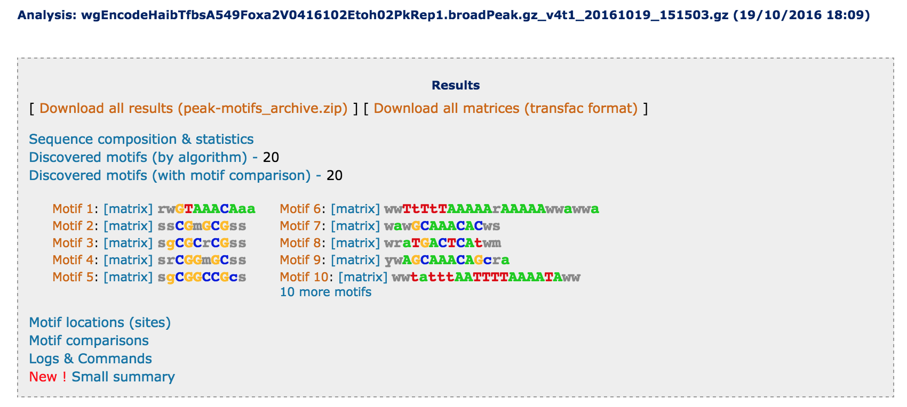

```{r setup, include=FALSE}
knitr::opts_chunk$set(echo = TRUE)
```


# Resources

| Name | URL / description |
|----------------|-------------------------------------------------|
| ENCODE | ENCODE access page at UCSC (<https://genome.ucsc.edu/ENCODE/>) |
|        | [Encode data matrix](https://genome.ucsc.edu/ENCODE/dataMatrix/encodeDataMatrixHuman.html)
|        | [ENCODE ChIP-seq experiment matrix](https://genome.ucsc.edu/ENCODE/dataMatrix/encodeChipMatrixHuman.html) |
| HOCOMOCO | Human + Mouse transcription factor database (<http://hocomoco.autosome.ru/>)|
| JASPAR | Eukaryote transcription factor database (<http://hocomoco.autosome.ru/>)|
| RSAT | Regulatory Sequence Analysis Tools (<http://rsat.eu/>) |
| bed format | <https://genome.ucsc.edu/FAQ/FAQformat#format1> |

****************************************************************
# Getting peak coordinates from ENCODE/HAIB

- open a connection to the ENCODE/HAIB TF binding site Web page
<http://genome.ucsc.edu/cgi-bin/hgFileUi?db=hg19&g=wgEncodeHaibTfbs>

    **Note:** when you access this page, it can take a few minutes to download the (huge) list of results. Don't despair, once it is loaded, the queries will be very fast.  

- Click on the box below **Antibody Target **, and select a transcription factor of interest (e.g. Foxa2). The list of displayed experiments is reduced to only show those corresponding to your factor. 

- Click on the box below **View**, and select **peaks**. The list is yet reduced to only show the peak files.

- Download the peak files in a new folder on your computer (e.g. Fox2_peaks) and uncompress the gzip files. 

## Getting sequences from peak coordinates

- Open a connection to the Regulatory Sequence Analysis Tools (RSAT) Web site: <http://rsat.eu/>

- Select one server (e.g. [RSAT Teaching](http://teaching.rsat.eu/)).

- In the left menu, open the section **NGS - ChIP-seq** and click on the tool **Fetch sequences from UCSC**. 


- Under **Upload a file from your computer**, click the **Choose file ...** option, and locate the peak file you downloaded from the ENCODE/Haib Web site. This file must contain peak coordinates in [bed format](https://genome.ucsc.edu/FAQ/FAQformat#format1), a text file with tab-separated values which specifies one feature per row (a peak in our case) and one attribute per column. The most important columns are the three first ones, which mush indicate the chromosome, start and end positions, respectively.

    - Example of bed format:
    
        ```
chr1    9911    10712   peak1   103     .       335.010 -1      -1
chr1    10939   11512   peak2   98      .       319.920 -1      -1
chr1    18353   18933   peak3   56      .       182.440 -1      -1
chr1    28879   29734   peak4   148     .       479.740 -1      -1
chr1    167774  168179  peak5   40      .       129.480 -1      -1
chr1    323847  324216  peak6   33      .       109.140 -1      -1
... (a lot more lines)
```

    - **Note:** in this 9-column bed format, the 6 first columns correspond to 1: chromosome, 2: start, 3: end, 4: name, 5: score, 6: strand (the dot means "unspecified"). Note that the three last columns of this ENCODE/Haib file are not properly specified ! (compare the content and the UCSC specifications). This is unfortunately very often the case in bioinformatics: some groups define standards, and many people follow them with some freedom, which is probably nice for human beings, but really problematic for computer-to-computer data exchanges. 
    
    - **Note:** *fetch-sequences* Web form supports compressed files in gzip format. If your network bandwidth is limited, you can thus submit the compressed bed file. 

- Select the **Genome** corresponding to your peak set. 

    - For our study case (`wgEncodeHaibTfbsA549Foxa2V0416102Etoh02PkRep1.broadPeak`) it is ***hg19 - Human Feb. 2009 (GCRH37/hg19)***, but beware: some ENCODE/Haib files were mapped on the Human genome gh18 assembly.


- Leave all other parameters unchanged and click **GO**. 

## What happens now?

The file with your peak coordinates is first transferred from your computer to the RSAT server, which then sends a request to the UCSC genome browser: *"I give you peak coordinates, please return the corresponding sequences"*. The resulting sequences are stored on the RSAT server, and a result form is generated with three links: 

1. *Genomic coordinates (bed)*: a copy of your query file
2. *Fetched sequences (fasta)*: the result file. You can click on this file to check that it indeed contains sequences. 
3. *Log file*: this contains the command that was executed on the RSAT server, the parameters and the execution log. This file is useful for tractability.


- After completion of the task, you can right-click on the *Fetched sequences (fasta)* file and store it on your computer in order to keep a copy of the sequence.

- We also recommend to keep a copy of the *Log file*, so that at any moment, you will be able to tace back the origin of your sequences. 

- once you have saved these two files, you are ready to submit your sequence to the next step of the analysis. In the **Next step** box below the result links, click on **peak-motifs**. This sends the URL of your sequence file to the *peak-motifs* form, and fills up the title box with the sequence file name. 

****************************************************************
# Discovering motifs in ChIP-seq peak sequences

## What the tool does

The RSAT tool *peak-motifs* implements a workflows which combines a lot of other RSAT tools in order to extract as much information as possible from your peak sequences: 

1. Some **statistics about sequences** (number, mean size, total size). 

2. **Sequence composition** in nucleotides and dinucleotides. Dinucleotide compositions are particularly informative, because they reflect dependencies between adjacent nucleotides, which cannot be predicted from the simple nucleotide composition. Dinucleotide frequencies vary between organisms, and, for a given organism, between types of genomic regions, and between peaksets depending on the ChIP-ped transcription factors. It is thus crucial to define these for each peak set, because they will be used as background model to scan sequences and predict putative binding sites. 

3. **Motif discovery**: by default, *peak-motifs* runs two complementary approaches to detect motifs based on the detection of (i) over-represented k-mer (*oligo-analysis*) and (ii) heterogeneous positional distribution of the k-mer around the peak centers (*position-analysis*).  Note that heterogeneous distributions can reflect various effects. 
    
    (a) Centering of a motif around the peak center, generally suggesting that this motif binds the ChIP-ped transcription factor or one of its interactants.
    (b) Avoidance of the motif in the central region, generally reflecting a contextual preference of the transcription factor (e.g. avoidance of AT-rich regions, reflected by poor complexity AT-rich motifs). 
    (c) In some cases one notices more specific patterns such as two narrow regions of over-representations just on the right and left side of the peak center, suggesting the presence of a co-factor bound in the same region as the ChIP-ped transcription factor. 

4. **Comparison between discovered motifs and annotated motifs from databases**. This indicates transcription factors which might bind to the discovered motifs. Usually the comparison returns several candidate factors, which may in some cases belong to the same transcription factor family (and thus have highly similar binding domains, which recognize very similar motifs). 

5. **Predicted binding sites**: after motif discovery, peak motifs scans the peak sequences to predict the location of binding sites, and computes a positional distribution of these predicted sites + some statistics about peak coverage (how many peaks have at least 1, 2, 3,... occurrences of the motif).

## Running peak-motifs

We will leave almost all the parameters unchanged, except for the selection of reference databases. 

- Under the main query box, peak-motifs displays subtitles enabling to fine-tune the advanced settings. 
- Click on the title *Compare discovered motifs with databases (e.g. against Jaspar) or custom reference motifs* and check the ** Hocomoco (Human TFs)** and **JASPAR core nonredundant vertebrates** databases. Make sure that all other databases are unchecked. 

- Enter your **email** at the bottom of the form. 

- Click **GO**. As soon as your query has been submitted to the server, you should receive an email with a link to the future result page. 

## What happens now?

The full analysis can take a while, since the ENCODE broad peak files are quite large (several tens of thousands of peaks, covering several tens of Mb of sequences). The *peak-motifs* tool is able to deal with such large files, but some steps require time. 

The results will be progressively displayed on the Web result page (you can check from time to time). Until completion, the result page displays a warning <font color="red">Status: running...</font>, but you can already analyse the partial results as they appear. 

After completion of the analysis, the result page will be updated and a gray box will be displayed at the top, with links to the discovered motifs + their colored consensus sequences. 

[](images/peak-motifs_result_header.png)

- At this stage, we strongly recommend you to click on the link **Download all results (peak-motifs_archive.zip)**, in order to keep a copy of the full results on your computer. Indeed, the results will only be kept on the server for a few days. It is important to keep a trace of all the elements of the analysis, since this ensures the tractability of each element of the results (sequence stats, composition, discovered motifs, candidate factors, predicted binding sites).

****************************************************************
# Going further

We suggest hereafter some additional sources of information about motif analysis from ChIP-seq peaks. 

- Description and evaluation of *RSAT peak-motifs*. 

    - Thomas-Chollier M, Herrmann C, Defrance M, Sand O, Thieffry D, van Helden J. (2012). RSAT peak-motifs: motif analysis in full-size ChIP-seq datasets. Nucleic Acids Res 40(4): e31. [PMID 22156162](http://www.ncbi.nlm.nih.gov/pubmed/22156162)


- Protocol for the utilization of *RSAT peak-motifs*. 

    - Thomas-Chollier M, Darbo E, Herrmann C, Defrance M, Thieffry D, van Helden J. (2012). A complete workflow for the analysis of full-size ChIP-seq (and similar) data sets using peak-motifs. Nat Protoc 7(8): 1551-1568. [PMID 22836136](http://www.ncbi.nlm.nih.gov/pubmed/22836136)


- Protocols for the analysis of ChIP-seq peaks in plants: 


    - Contreras-Moreira B, Castro-Mondragon JA, Rioualen C,	Cantalapiedra CP, van Helden J. (2016). RSAT::Plants: Motif	Discovery Within Clusters of Upstream Sequences in Plant Genomes. Methods Mol Biol. 1482:279-95. doi:	10.1007/978-1-4939-6396-6_18. [PMID 27557774](http://www.ncbi.nlm.nih.gov/pubmed/27557774)

	   - Helden J. (2016). RSAT::Plants: Motif Discovery in ChIP-Seq Peaks of Plant Genomes. Methods Mol Biol. 1482:297-322. doi: 10.1007/978-1-4939-6396-6_19. [PMID 27557775](http://www.ncbi.nlm.nih.gov/pubmed/27557775)


****************************************************************

*Contact and bug reports: <Jacques.van-Helden@univ-amu.fr>*

