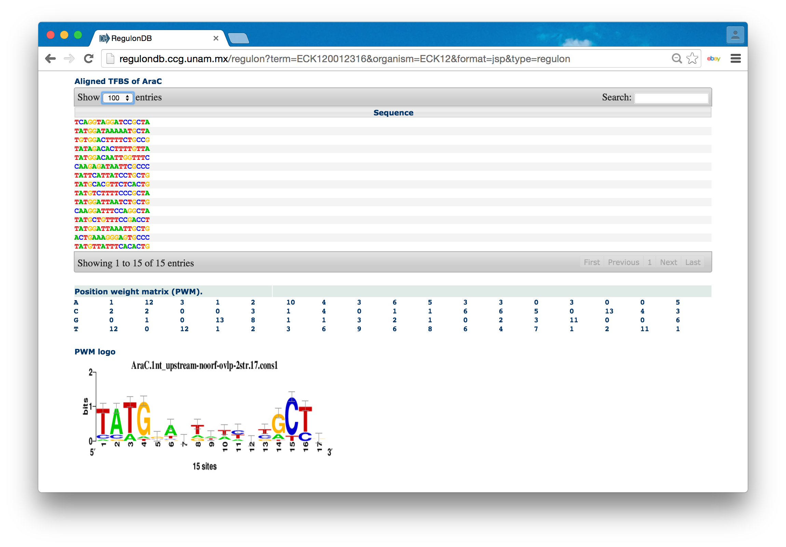

## Collection of binding sites

- Results of the [query "AraC" in RegulonDB](http://regulondb.ccg.unam.mx/search?term=AraC&organism=ECK12&type=All)


- Find the section 'Alignment and PSSM for AraC TFBSs' to the [AraC record in RegulonDB](http://regulondb.ccg.unam.mx/regulon?term=ECK120012316&organism=ECK12&format=jsp&type=regulon).


 

- [AraC aligned sites in 'multi' format](results_sequence_scanning/AraC_sites.multi)

- Conversion of site sequences from multi to fasta 

```
convert-seq  -i AraC_sites.multi -from multi -to fasta -o AraC_sites.fa
```

- [AraC aligned sites in 'fasta' format](results_sequence_scanning/AraC_sites.fasta)


## Getting the matrix and its consensus

- [AraC matrix in tab-delimited format](results_sequence_scanning/AraC_regulonDB_matrix.tab)


- [AraC consensus computed by convert-matrix](results_sequence_scanning/AraC_consensus.txt): tatGgaytwwycyGCyr

## Retrieving all upstream sequences


## Scanning upstream sequences with AraC consensus

**Beware:** we recomment to adapt the dna-pattern parameters as follows: 

- inactivate the options *match positions* and *sequence limits*
- activate *match counts* and set *min counts* to 1


## Analzing the distribution of scores with matrix-distrib 

## Scanning upstream sequences with the AraC matrix


