___

## Protein-DNA recognition

DNA-binding proteins contain DNA-binding domains and have a specific or general affinity for either single or double stranded DNA. Here we will concentrate mostly on transcription factors, which generally recognize cis-regulatory elements in double-stranded DNA molecules.

### Dissecting a protein-DNA interface

Transcription factors recognize target DNA sequences through a binding interface, composed of protein residues and DNA stretches in intimate contact.
The best descriptions of protein-DNA interfaces are provided by structural biology, usually by X-ray or NMR experiments.

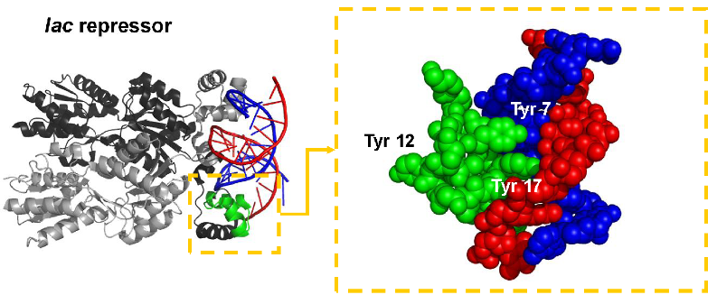 

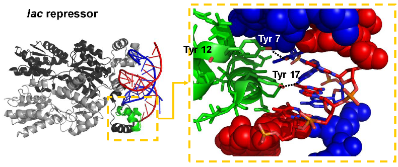 

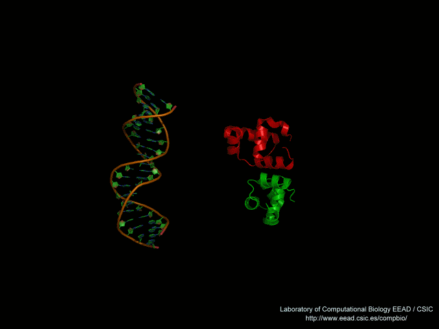 

### Atomic interactions between protein and DNA residues

The process of recognition of DNA sequences by proteins involves readout mechanisms, and also accessory stabilizing atomic interaction that do not confer specificty.

**Direct readout** 

* Hydrogen bonds: direct + water-mediated
* Hydrophobic interactions

**Indirect readout**

* Sequence-specific deformation of DNA base steps

**Stabilizing interactions**

* Not sequence-specific, involving DNA backbone

### Direct readout: hydrogen bonds

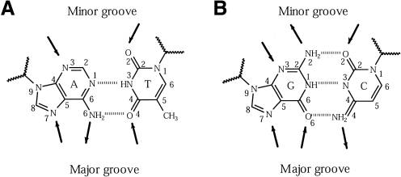 

### Direct readout: Van der Waals interactions

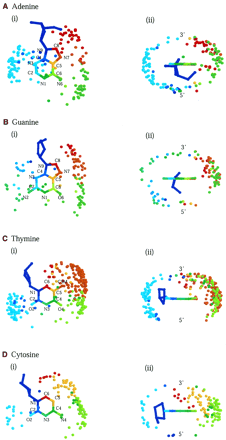

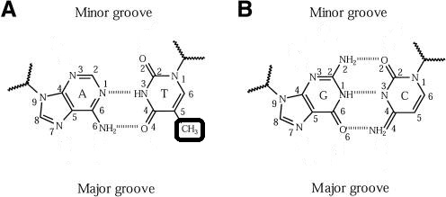

### Indirect/shape readout

Besides atomic interactions between protein and DNA, Sequence-dependent deformability of duplexes, deduced from crystal complexes, implies that sequence recognition also involves DNA shape.

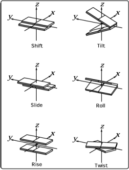

DNA deformation is described by the increase in energy brought about by instantaneous fluctuations of the step parameters from their equilibrium values:

$deformation = \displaystyle\sum_{i=0}^6 \displaystyle\sum_{j=0}^6 spring_{ij} \Delta\theta_{i,st} \Delta\theta_{j,st}$ @Olson1998

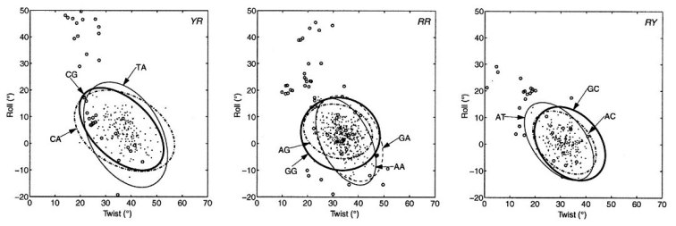

The accumulation of experimental and molecular dynamics data of DNA molecules currently supports predictive algorithms, such as [DNAshape](http://rohslab.cmb.usc.edu/DNAshape/), which predict the geometry of DNA sequences:  

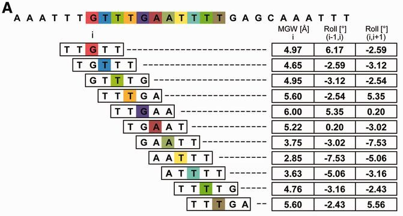

### Protein-DNA interface graphs

Interfaces can be explored as generic bipartite graphs:

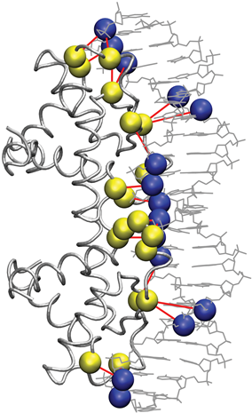

Or sub-graphs that focus on specific sequence recognition:

 , @ContrerasMoreira2010](pics/1je8-intf.png)


### Comparison of DNA-binding proteins

A great variety of DNA-binding proteins has been observed in nature, which can be analyzed and compared in terms of the features introduced above, such as readout, or instead with an evolutionary or topological perspective.  

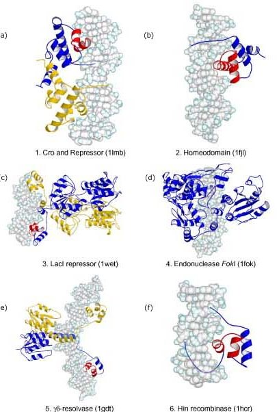

The  [Structural Classification of Proteins (SCOP)](http://scop.berkeley.edu) systematically groups protein folds in superfamilies, of which some are the most common DNA-binding proteins. The next table shows superfamilies with more than 20 non-redundant complexes in the [Protein Data Bank](http://www.rcsb.org) as of October, 2015, as annotated in the database [3d-footprint](http://floresta.eead.csic.es/3dfootprint/):

SCOP superfamily | Number of complexes
---------------- | -------------------
Winged helix (WH) | 77
Homeodomain-like (H) | 63
Glucocorticoid-receptor-like (GR) | 33
Restriction endonuclease-like (RE) | 24 
Homing endonuclease (HE) | 23 
p53-like (P53) | 21
Lambda-repressor-like (LR) | 21

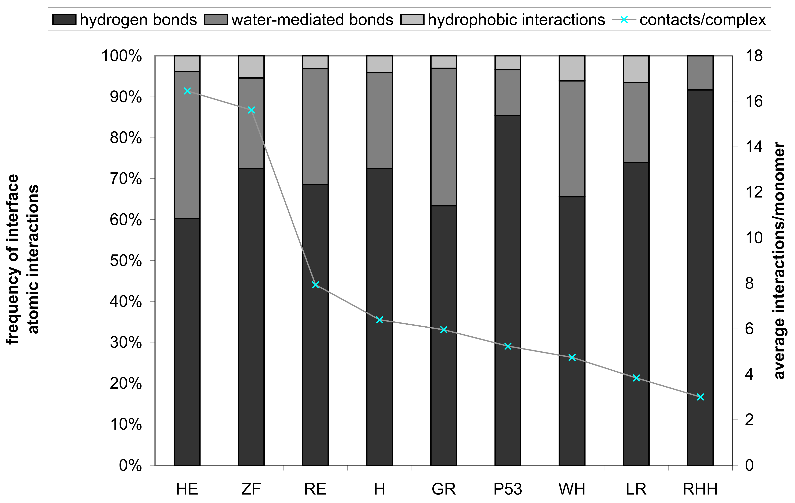

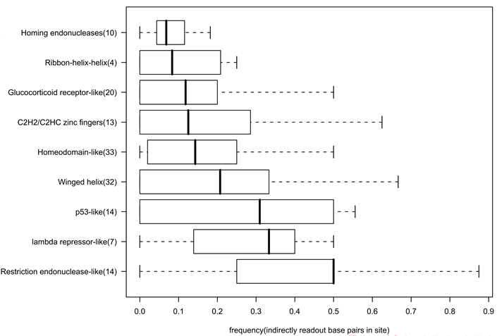

### Family wide analysis of protein-DNA interfaces

The available experimental structures of protein-DNA complexes in the PDB support the annotation of interface residues, those involved directly in sequence recognition, within protein families.

, from @Sebastian2014.](pics/intf-annot-hist.png)

Several examples in the literature have demonstrated the correlation between interface patterns and the bound DNA motifs within large transcription factor families, such as the work of @Noyes2008:

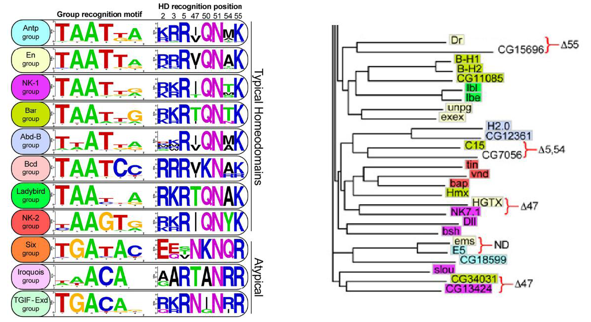

Structural data are key for the study of interfaces, as well as the structural superposition of DNA-binding domains:


### Exercise 1: analyzing interfaces and inferring DNA motifs using only sequence data

In summary, interfaces seem to be relevant for proteins that bind to DNA in a sequence-specific manner. How can we define the interface of a protein sequence of interest? If the protein structure has been experimentally analyzed docked to a DNA ligand, then this is the best option. Several resources can help us in this task, such as  [NPIDB](http://npidb.belozersky.msu.ru) or [3D-footprint](http://floresta.eead.csic.es/3dfootprint). Others such as [BIPA](http://mordred.bioc.cam.ac.uk/bipa), [PDIdb](http://melolab.org/pdidb) as also very useful, but are less frequently updated.

However, for most protein sequences structural data is simply not available. In these cases interface residues can only be predicted based on the structures of homologous DNA-binding proteins, and that's precisely what [footprintDB](http://floresta.eead.csic.es/footprintdb) does. In addition to interface annotation, footprintDB annotates a wide selection of high quality DNA motifs, extracted from a series of public databases. We will demonstrate its use now with **human hox-b1**: 

```
>Homeobox protein hox-b1 (part of P40424|PBX1_HUMAN)
MEPNTPTART FDWMKVKRNP PKTAKVSEPG LGSPSGLRTN FTTRQLTELE 
KEFHFNKYLS RARRVEIAAT LELNETQVKI WFQNRRMKQK KREREGG
```

1. If you paste the protein sequence of hox-b1 in the sequence search form of [footprintDB](http://floresta.eead.csic.es/footprintdb) you'll get a list of similar proteins, with annotated interfaces in most cases, together with their experimentally derived DNA motifs. 

2. Can you check the interfaces of the matched transcription factors (TF) and tell whether they are conserved? NOTE: You can check the alignments clicking in the BLAST e-value or interface similarity links.

3. Compare the cognate DNA motifs of TFs with different annotated interface.

4. If you have admin rights on a Linux/OS-X machine please install Perl module SOAP::Lite with an appropriate command such as ``` sudo cpan -i SOAP::Lite ``` and then save the next script and run it on you terminal with ```perl script.pl```:

```
#!/usr/bin/perl -w  
use strict;
use SOAP::Lite;

my $footprintDBusername = ''; # your username if registered
my ($result,$sequence,$sequence_name) = ('','','');

my $server = SOAP::Lite
-> uri('footprintdb')
-> proxy('http://floresta.eead.csic.es/footprintdb/ws.cgi');

$sequence_name = 'hox-b1';
$sequence = 'MEPNTPTART FDWMKVKRNP PKTAKVSEPG LGSPSGLRTN FTTRQLTELE KEFHFNKYLS RARRVEIAAT LELNETQVKI WFQNRRMKQK KREREGG';

$result = $server->protein_query($sequence_name,$sequence,$footprintDBusername);

unless($result->fault()){ print $result->result(); }
else{ print 'error: ' . join(', ',$result->faultcode(),$result->faultstring()); }
```

5. In order to just predict interfaces of your sequences you can use the next script: 

```
#!/usr/bin/perl -w
use strict;
use SOAP::Lite;

my $URI   = 'http://floresta.eead.csic.es/footprint';
my $WSURL = 'http://floresta.eead.csic.es/3dpwm/scripts/server/ws.cgi';

my $soap = SOAP::Lite
-> uri($URI)
-> proxy($WSURL);

my $result = $soap->protein_query('MEPNTPTART FDWMKVKRNP PKTAKVSEPG LGSPSGLRTN FTTRQLTELE KEFHFNKYLS RARRVEIAAT LELNETQVKI WFQNRRMKQK KREREGG');

unless($result->fault){ print $result->result(); }
else{ print 'error: ' . join(', ',$result->faultcode,$result->faultstring); }

```


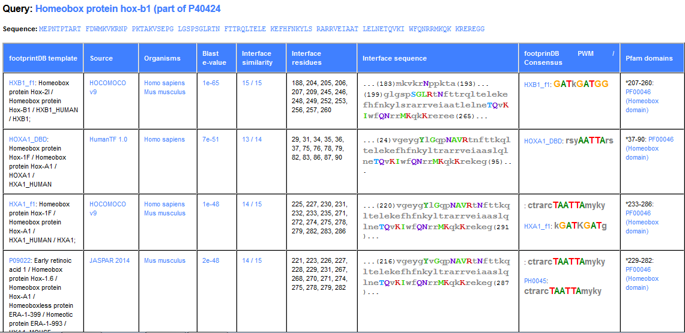

### Exercise 2: comparing binding interfaces using atomic coordinates

Here we will test a structural alignment approach for the comparison of DNA-binding proteins and their interfaces, as discussed in the literature @Siggers2005, @Sebastian2013. In this context superpositions are a tool to guide the correct alignment of cis elements bound by homologous proteins, as illustrated in the figure.

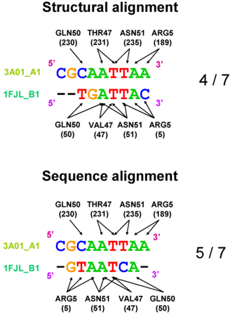

This kind of analysis can be done with publicly available software, such as locally installed [Protein-DNA_Interface_Alignment](http://wiki.c2b2.columbia.edu/honiglab_public/index.php/Software:Protein-DNA_Interface_Alignment), or the web server [TFcompare](http://floresta.eead.csic.es/tfcompare/), which we will test in this session:

1. Visit the [Protein Data Bank](http://www.rcsb.org) and check entries 3A01 and 1FJL: what are these proteins?

2. Type both PDB codes in the search form of <http://floresta.eead.csic.es/tfcompare> and wait for your results. 

3. How many domains are annotated in each protein, of which [Pfam](http://pfam.xfam.org) families?

4. Spot the pairs of domains with lowest protein and DNA root-mean square deviations (RMSD) and check their 3D alignments to visually check their fit. Is there an obvious structure-based cis element alignment? _NOTE: you might need to add floresta.eead.cisc.es as an exception in your Java config._

___

## Mining sequence motifs from the structure of protein-DNA complexes

### Total contacts model
Morozov, Lichtarge

### Readout model
DNAPROT, Sarai, Lavery

### Specificity-based classification of DNA-binding proteins
DNAPROT

### Genomic benchmarks 

Ejercicio con 3d-footprint & matrix-quality, con alugnp por ejemplo
http://161.111.227.80/compbio/material/regulatory_proteins/node7.html

### 3D-footprint and footprintDB
a repository of DNA motifs, including structure-based, which annotates the corresponding binding protein and its interface

Ejercicio con footprintDB (capítulo de libro?)

___

## References
