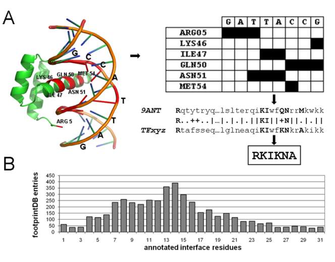
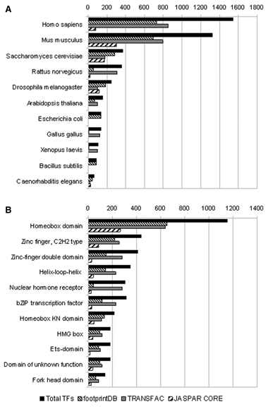
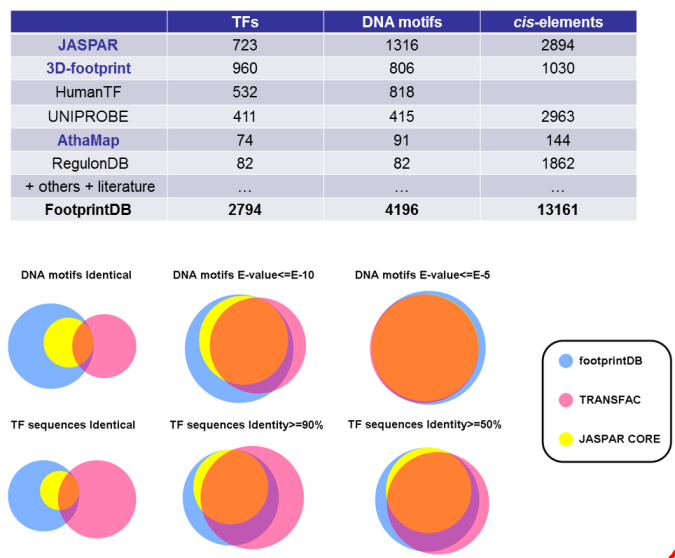
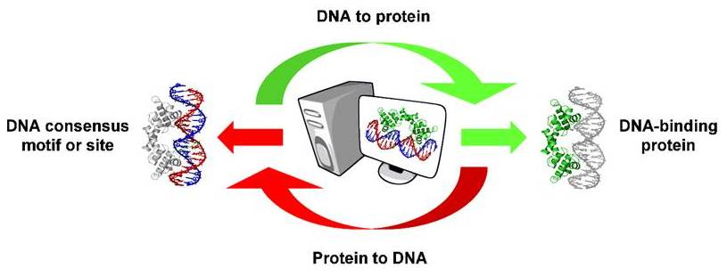
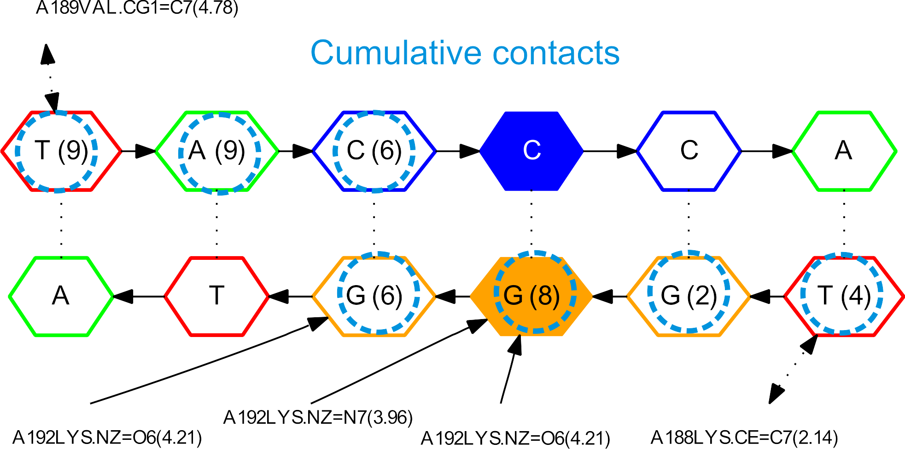
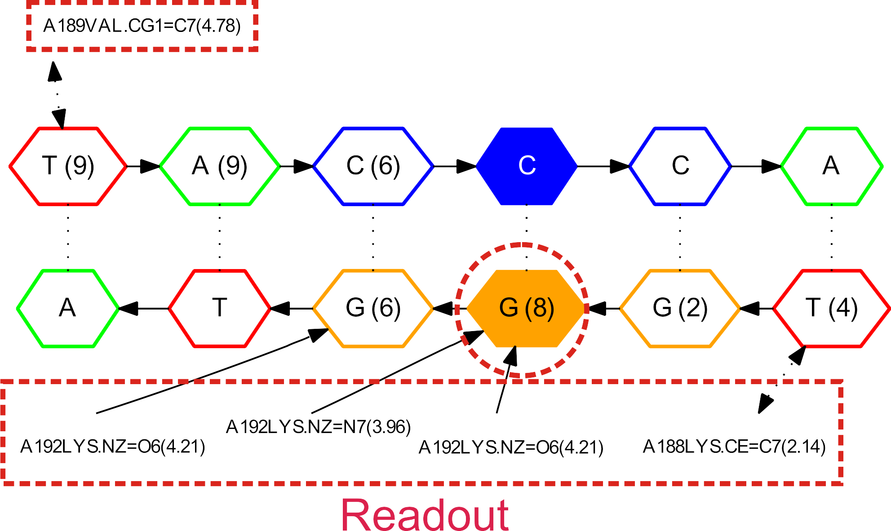
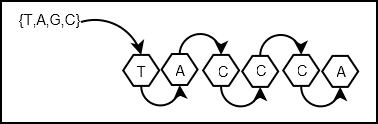
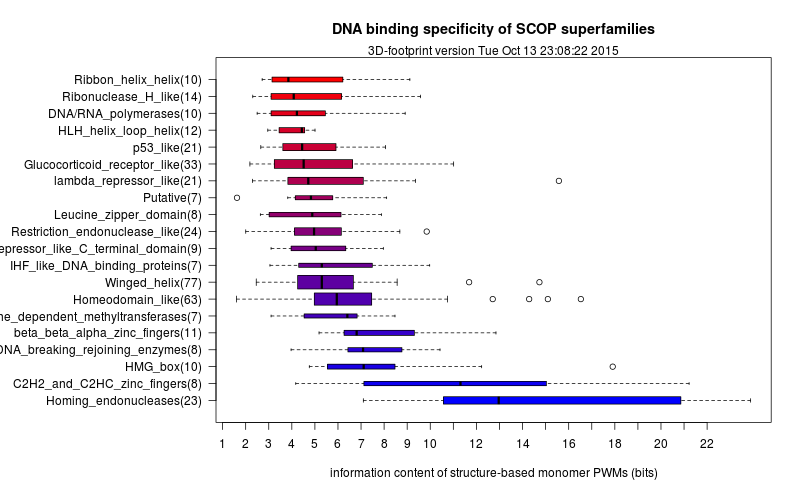
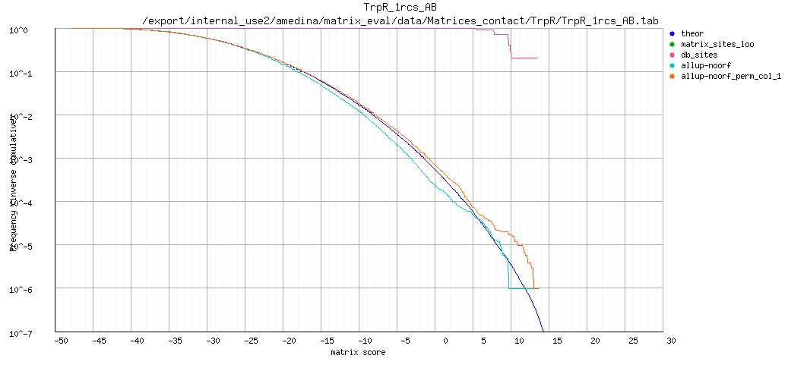
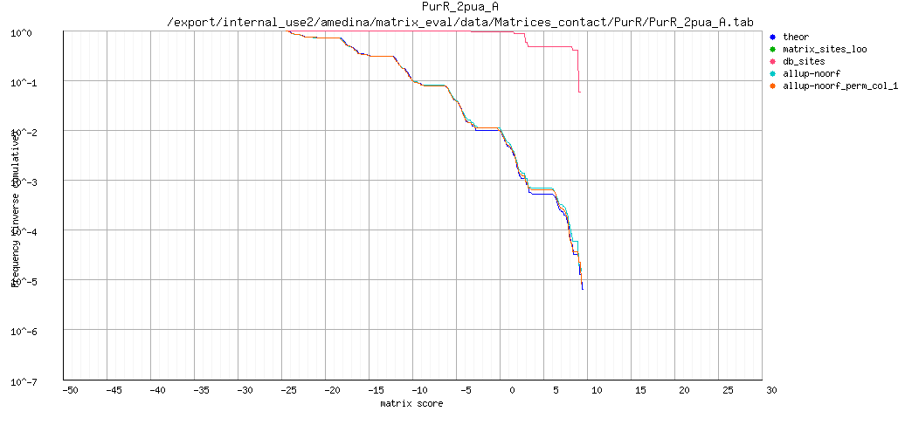

___

## Protein-DNA recognition

DNA-binding proteins contain DNA-binding domains and have a specific or general affinity for either single or double stranded DNA. Here we will concentrate mostly on transcription factors, which generally recognize cis-regulatory elements in double-stranded DNA molecules.

### Dissecting a protein-DNA interface

Transcription factors recognize target DNA sequences through a binding interface, composed of protein residues and DNA stretches in intimate contact.
The best descriptions of protein-DNA interfaces are provided by structural biology, usually by X-ray or NMR experiments.

 

 

 

### Atomic interactions between protein and DNA residues

The process of recognition of DNA sequences by proteins involves readout mechanisms, and also accessory stabilizing atomic interaction that do not confer specificty.

**Direct readout** 

* Hydrogen bonds: direct + water-mediated
* Hydrophobic interactions

**Indirect readout**

* Sequence-specific deformation of DNA base steps

**Stabilizing interactions**

* Not sequence-specific, involving DNA backbone

### Direct readout: hydrogen bonds

 

### Direct readout: Van der Waals interactions


### Indirect/shape readout

Besides atomic interactions between protein and DNA, sequence-dependent deformability of duplexes, deduced from crystal complexes, implies that sequence recognition also involves DNA shape.


DNA deformation is described by the increase in energy brought about by instantaneous fluctuations of the step parameters from their equilibrium values:

$deformation = \displaystyle\sum_{i=0}^6 \displaystyle\sum_{j=0}^6 spring_{ij} \Delta\theta_{i,st} \Delta\theta_{j,st}$ (@Olson1998)


The accumulation of experimental and molecular dynamics data of DNA molecules currently supports predictive algorithms, such as [DNAshape](http://rohslab.cmb.usc.edu/DNAshape/), which predict the geometry of DNA sequences:  


### Protein-DNA interface graphs

Interfaces can be explored as generic bipartite graphs (@Sathyapriya2008) or with sub-graphs that focus only on specific sequence recognition:

 (@ContrerasMoreira2010)](pics/1je8-intf.png)


### Comparison of DNA-binding proteins

A great variety of DNA-binding proteins has been observed in nature, which can be analyzed and compared in terms of the features introduced above, such as readout, or instead with an evolutionary or topological perspective.  


The  [Structural Classification of Proteins (SCOP)](http://scop.berkeley.edu) systematically groups protein folds in superfamilies, of which some are the most common DNA-binding proteins. The next table shows superfamilies with more than 20 non-redundant complexes in the [Protein Data Bank](http://www.rcsb.org) as of October, 2015, as annotated in the database [3d-footprint](http://floresta.eead.csic.es/3dfootprint/):

SCOP superfamily | Number of complexes
---------------- | -------------------
Winged helix (WH) | 77
Homeodomain-like (H) | 63
Glucocorticoid-receptor-like (GR) | 33
Restriction endonuclease-like (RE) | 24 
Homing endonuclease (HE) | 23 
p53-like (P53) | 21
Lambda-repressor-like (LR) | 21


### Analysis of protein-DNA interfaces in transcription factors families

The available experimental structures of protein-DNA complexes in the PDB support the annotation of interface residues, those involved directly in sequence recognition, within protein families.



Several examples in the literature have demonstrated the correlation between interface patterns and the bound DNA motifs within large transcription factor families, such as the work of @Noyes2008:


Structural data are key for the study of interfaces, as well as the structural superposition of DNA-binding domains:


The study of interfaces must be done in the appropriate biological context, for instance considering the oligomerization state of TFs _in vivo_, as each family of transcription factors has singularities, such as these (compiled by Álvaro Sebastián):

Family | Motifs | Multimeric | Multidomain
------ | ------ | ---------- | -----------
Homeodomain	| TAATkr,TGAyA | Sometimes | Unusual
Basic helix-loop-helix (bHLH)	| CACGTG,CAsshG	| Always (homodimers, heterodimers)	| Never
Basic leucine zipper (bZIP)	| CACGTG,-ACGT-,TGAGTC | Always (homodimers, heterodimers) | Never
MYB	| GkTwGkTr | Common (multimers)	| Common
High mobility group (HMG)	| mTT(T)GwT,TTATC,ATTCA | Sometimes	| Unusual
GAGA | GAGA	| Never	| Never
Fork head	| TrTTTr | Unusual | Never
Fungal Zn(2)-Cys(6) binuclear cluster |	CGG	| Common (homodimers) | Never
Ets	| GGAw | Common (homodimers, heterodimers, multimers)	| Never
Rel homology domain (RHD) |	GGnnwTyCC |	Always (homodimers, heterodimers)	| Never
Interferon regulatory factor | AAnnGAAA	| Always (homodimers, heterodimers, multimers) |	Never

### A tour of footprintDB

[FootprintDB](http://floresta.eead.csic.es/footprintdb) is a meta-database that integrates the most comprehensive freely available libraries of curated cis elements and systematically annotates the binding interfaces of the corresponding TFs.





FootprintDB takes two types of queries:
1. Transcription factors which bind a specific DNA site or motif.
2. DNA motifs likely to be recognized by a specific DNA-binding protein.




### Exercise 1: analyzing interfaces and inferring DNA motifs using only sequence data

In summary, interfaces seem to be relevant for proteins that bind to DNA in a sequence-specific manner. How can we define the interface of a protein sequence of interest? If the protein structure has been experimentally analyzed docked to a DNA ligand, then this is the best option. Several resources can help us in this task, such as  [NPIDB](http://npidb.belozersky.msu.ru) or [3D-footprint](http://floresta.eead.csic.es/3dfootprint). Others such as [BIPA](http://mordred.bioc.cam.ac.uk/bipa), [PDIdb](http://melolab.org/pdidb) as also very useful, but are less frequently updated.

However, for most protein sequences structural data is simply not available. In these cases interface residues can only be predicted based on the structures of homologous DNA-binding proteins, and that's precisely what [footprintDB](http://floresta.eead.csic.es/footprintdb) does. In addition to interface annotation, footprintDB annotates a wide selection of high quality DNA motifs, extracted from a series of public databases. We will demonstrate its use now with **human hox-b1**: 

```
>Homeobox protein hox-b1 (part of P40424|PBX1_HUMAN)
MEPNTPTART FDWMKVKRNP PKTAKVSEPG LGSPSGLRTN FTTRQLTELE 
KEFHFNKYLS RARRVEIAAT LELNETQVKI WFQNRRMKQK KREREGG
```

1. If you paste the protein sequence of hox-b1 in the sequence search form of [footprintDB](http://floresta.eead.csic.es/footprintdb) you'll get a list of similar proteins, with annotated interfaces in most cases, together with their experimentally derived DNA motifs. 

2. Can you check the interfaces of the matched transcription factors (TF) and tell whether they are conserved? NOTE: You can check the alignments clicking in the BLAST e-value or interface similarity links.

3. Compare the cognate DNA motifs of TFs with different annotated interfaces.

4. If you have admin rights on a Linux/OS-X machine please install Perl module SOAP::Lite with an appropriate command such as ``` sudo cpan -i SOAP::Lite ``` and then save the next script and run it on you terminal with ```perl script.pl```:

```
#!/usr/bin/perl -w  
use strict;
use SOAP::Lite;

my $footprintDBusername = ''; # your username if registered
my ($result,$sequence,$sequence_name) = ('','','');

my $server = SOAP::Lite
-> uri('footprintdb')
-> proxy('http://floresta.eead.csic.es/footprintdb/ws.cgi');

$sequence_name = 'hox-b1';
$sequence = 'MEPNTPTART FDWMKVKRNP PKTAKVSEPG LGSPSGLRTN FTTRQLTELE KEFHFNKYLS RARRVEIAAT LELNETQVKI WFQNRRMKQK KREREGG';

$result = $server->protein_query($sequence_name,$sequence,$footprintDBusername);

unless($result->fault()){ print $result->result(); }
else{ print 'error: ' . join(', ',$result->faultcode(),$result->faultstring()); }
```

5. In order to just predict interfaces of your sequences you can use the next script: 

```
#!/usr/bin/perl -w
use strict;
use SOAP::Lite;

my $URI   = 'http://floresta.eead.csic.es/footprint';
my $WSURL = 'http://floresta.eead.csic.es/3dpwm/scripts/server/ws.cgi';

my $soap = SOAP::Lite
-> uri($URI)
-> proxy($WSURL);

my $result = $soap->protein_query('MEPNTPTART FDWMKVKRNP PKTAKVSEPG LGSPSGLRTN FTTRQLTELE KEFHFNKYLS RARRVEIAAT LELNETQVKI WFQNRRMKQK KREREGG');

unless($result->fault){ print $result->result(); }
else{ print 'error: ' . join(', ',$result->faultcode,$result->faultstring); }

```


### Exercise 2: comparing binding interfaces using atomic coordinates

Here we will test a structural alignment approach for the comparison of DNA-binding proteins and their interfaces, as discussed in the literature (@Siggers2005, @Sebastian2013). In this context superpositions are a tool to guide the correct alignment of cis elements bound by homologous proteins, as illustrated in the figure.


This kind of analysis can be done with publicly available software, such as locally installed [Protein-DNA_Interface_Alignment](http://wiki.c2b2.columbia.edu/honiglab_public/index.php/Software:Protein-DNA_Interface_Alignment), or the web server [TFcompare](http://floresta.eead.csic.es/tfcompare/), which we will test in this session:

1. Visit the [Protein Data Bank](http://www.rcsb.org) and check entries 3A01 and 1FJL: what are these proteins?

2. Type both PDB codes in the search form of <http://floresta.eead.csic.es/tfcompare> and wait for your results. 

3. How many domains are annotated in each protein, of which [Pfam](http://pfam.xfam.org) families?

4. Spot the pairs of domains with lowest protein and DNA root-mean square deviations (RMSD) and check their 3D alignments to visually check their fit. Is there an obvious structure-based cis element alignment? 
_NOTE: you might need to add floresta.eead.csic.es as an exception in your Java config to display Jmol._


## Mining sequence motifs from the structure of protein-DNA complexes

Here we will see two complementary ways to infer sequence motifs recognized by transcriptions factors for which a protein-DNA complex structure has been solved.

### Total contacts model: Morozov algorithm 


____

After counting all heavy-atom contacts per base pair, the algorithm is as follows (@Morozov2007):

1. $C_{n} = contacts(n) / 20$ , ($4.5A$ heavy atoms)
2. Each value in the resulting frequency DNA motif is: $W_{n,b}(contacts) = \begin{cases}1 (1 + 3C_{n}) & (b = consensus),\\1 (1-C_{n}) & (b \neq consensus)\end{cases}$

### Readout model: DNAPROT algorithm



_____

The DNA algorithm explicitly estimates direct + indirect readout and really is an _in silico_ mutagenesis experiment of native DNA with the following steps involved:

1. Perform $4N$ mutations in template DNA:


2. Score mutations with statistical potentials and calculate each value in the resulting weight matrix with this expression, where D is the relative weight of indirect readout: 
$W_{n,b} = e^{(-((1-D)*direct(n,b) + D * indirect(n,b)))}$

Compared to the approach of @Morozov2007, this protocol is computationally more expensive and it is, in our experience, more dependent on the quality of the underlying structural data. 

Further details of this algorithm are available in @Espinosa2008, and binaries (and source code) of DNAPROT, which implements both strategies, is available at <http://eead.csic.es/compbio/soft/dnaprot.php>. 
The atomic pair potentials of interaction are updated weekly and are available at <http://floresta.eead.csic.es/3dfootprint/download.html>.

### Specificity-based classification of DNA-binding proteins

DNA motifs resulting from combinations of both previously described strategies are routinely calculated for PDB complexes annotated in [3D-footprint](http://floresta.eead.csic.es/3dfootprint), and ultimately included in footprintDB. 

These structure-based DNA motifs, analyzed in terms of their information content, are also used to feed a plot of the specificity of SCOP superfamilies, updated weekly at <http://floresta.eead.csic.es/3dfootprint/stats/superfam_specificity.png>:



### Exercise 3: obtaning and evaluating structure-based motifs

Here we will learn i) how to produce a structure-based motif out of a protein-DNA complex in 
[PDB format](http://www.wwpdb.org/documentation/file-format) and ii) how to evaluate its predictive value. With these goals in mind I suggest we can work with any of the following _Escherichia coli_ TFs originally annotated in [RegulonDB](http://regulondb.ccg.unam.mx/):

protein name | footprintDB entry | matrix-quality report
------------ | ------------------ | ---------------------
Ada | [1zgw_A](http://floresta.eead.csic.es/footprintdb/index.php?db=3D-footprint:20150526&motif=1zgw_A) | [Ada_1zgw_A](http://floresta.eead.csic.es/3dfootprint/bench/matrix_quality/20100311/Ada/Ada_1zgw_A.tab/Ada_1zgw_A.tab_quality_index.html)
CRP | [1cgp_AB](http://floresta.eead.csic.es/footprintdb/index.php?db=3D-footprint:20150526&motif=1cgp_AB) | [CRP_1cgp_AB](http://floresta.eead.csic.es/3dfootprint/bench/matrix_quality/20100311/CRP/CRP_1cgp_AB.tab/CRP_1cgp_AB.tab_quality_index.html)
DnaA | [1j1v_A](http://floresta.eead.csic.es/footprintdb/index.php?db=3D-footprint:20150526&motif=1j1v_A) | [DnaA_1j1v_A](http://floresta.eead.csic.es/3dfootprint/bench/matrix_quality/20100311/DnaA/DnaA_1j1v_A.tab/DnaA_1j1v_A.tab_quality_index.html)
FadR | [1hw2_AB](http://floresta.eead.csic.es/footprintdb/index.php?db=3D-footprint:20150526&motif=1hw2_AB) | [FadR_1hw2_AB](http://floresta.eead.csic.es/3dfootprint/bench/matrix_quality/20100311/FadR/FadR_1hw2_AB.tab/FadR_1hw2_AB.tab_quality_index.html)
LacI | [1efa_AB](http://floresta.eead.csic.es/footprintdb/index.php?db=3D-footprint:20150526&motif=1efa_AB) | [LacI_1efa_AB](http://floresta.eead.csic.es/3dfootprint/bench/matrix_quality/20100311/LacI/LacI_1efa_AB.tab/LacI_1efa_AB.tab_quality_index.html)
MarA | [1bl0_A](http://floresta.eead.csic.es/footprintdb/index.php?db=3D-footprint:20150526&motif=1bl0_A) | [MarA_1bl0_A](http://floresta.eead.csic.es/3dfootprint/bench/matrix_quality/20100311/MarA/MarA_1b10_A.tab/MarA_1b10_A.tab_quality_index.html)
NarL | [1je8_AB](http://floresta.eead.csic.es/footprintdb/index.php?db=3D-footprint:20150526&motif=1je8_AB) | [NarL_1je8_AB](http://floresta.eead.csic.es/3dfootprint/bench/matrix_quality/20100311/NarL/NarL_1je8_AB.tab/NarL_1je8_AB.tab_quality_index.html)
PhoB | [1gxp_AB](http://floresta.eead.csic.es/footprintdb/index.php?db=3D-footprint:20150526&motif=1gxp_AB) | [PhoB_1gxp_AB](http://floresta.eead.csic.es/3dfootprint/bench/matrix_quality/20100311/PhoB/PhoB_1gxp_AB.tab/PhoB_1gxp_AB.tab_quality_index.html)
PurR | [2pua_A](http://floresta.eead.csic.es/footprintdb/index.php?db=3D-footprint:20150526&motif=2pua_A) | [PurR_2pua_A](http://floresta.eead.csic.es/3dfootprint/bench/matrix_quality/20100311/PurR/PurR_2pua_A.tab/PurR_2pua_A.tab_quality_index.html)
Rob | [1d5y_AB](http://floresta.eead.csic.es/footprintdb/index.php?db=3D-footprint:20150526&motif=1d5y_AB) | [Rob_1d5y_AB](http://floresta.eead.csic.es/3dfootprint/bench/matrix_quality/20100311/Rob/Rob_1d5y_AB.tab/Rob_1d5y_AB.tab_quality_index.html)
TrpR | [1rcs_AB](http://floresta.eead.csic.es/footprintdb/index.php?db=3D-footprint:20150526&motif=1rcs_AB) | [TrpR_1rcs_AB](http://floresta.eead.csic.es/3dfootprint/bench/matrix_quality/20100311/TrpR/TrpR_1rcs_AB.tab/TrpR_1rcs_AB.tab_quality_index.html)

1. Inspect the footprintDB entry of one or more of these TFs and, 
  - 1.1 check the primary accession to find the corresponding Protein Data Bank structure.
  - 1.2 Check the information content of the structure-based DNA motif

2. In the PDB site,
  - 2.1 In the "Molecular Description" section, check how many protein and DNA molecules are captured in the structure. 
  _ 2.2 Download the 'PDB File (Test)' with the coordinates of the complex to a local file in your computer. If there are more than 1 complex edit the file and leave only one of them. Software such as [Rasmol](http://www.openrasmol.org/) or [PyMOL](https://www.pymol.org/) can be useful for this task.

3. Visit the [3D-footprint interactive tool](http://floresta.eead.csic.es/3dfootprint/footprint.html), upload your PDB file and submit the job. You might want to try several parameter combinations. By default readout (DNAPROT) and contact (Morozov) matrices are averaged with equal weights.
  - 3.1 Revise the "Original Interface contacts" and the interface graph, what kind of interactions where detected? 
  - 3.2 Compare the "readout" and "contact" sequence logos, are they compatible or perhaps there are some inconsistencies?
  - 3.3 Save the structure-based DNA motif produced to a local file.
  
4. Visit [RSAT::matrix-quality](http://pedagogix-tagc.univ-mrs.fr/rsat) (@Medina2011) and evaluate the predictive value of the obtained matrix (tab format) by comparing it to the corresponding set of experimentally obtained _cis_ regulatory sites (see Table) by scanning all E.coli K12 upstream regions in this file:  [Escherichia_coli_K12_allup-noorf_min30_max500.fasta](data/Escherichia_coli_K12_allup-noorf_min30_max500.fasta).     
  - 4.1 Upload the FASTA file with experimental sites as sequence "Dataset 1". Tag this set as "DBsites"
  - 4.2 Upload upstream sequences file as "Dataset 2" and choose "Number of matrix permutations" = 1. Tag this set as "all_upstream"
  - 4.3 Select a Markov background model of order 1 (precomputed in the server for _E.coli_)
  - 4.4 Press "Submit", the job will take some minutes.

protein name | RegulonDB curated cis elements
------------ | ------------------------------
Ada | [Ada.fna](data/Ada.fna)  
CRP | [CRP.fna](data/CRP.fna)
DnaA | [DnaA.fna](data/DnaA.fna)
FadR | [FadR.fna](data/FadR.fna)
LacI | [LacI.fna](data/LacI.fna)
MarA | [MarA.fna](data/MarA.fna)
NarL | [NarL.fna](data/NarL.fna)
PhoB | [PhoB.fna](data/PhoB.fna)
PurR | [PurR.fna](data/PurR.fna)
Rob | [Rob.fna](data/Rob.fna)
TrpR | [TrpR.fna](data/TrpR.fna)






## References
