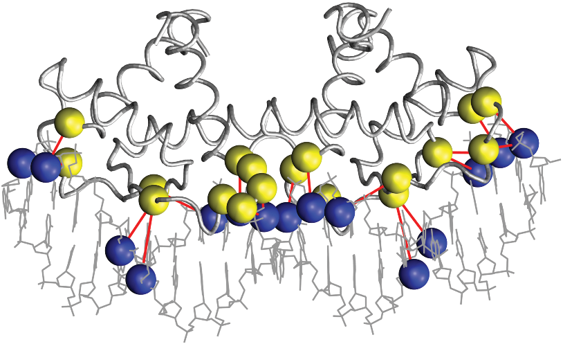

___

## Protein-DNA recognition

DNA-binding proteins contain DNA-binding domains and thus have a specific or general affinity for either single or double stranded DNA.

### Dissecting a protein-DNA interface

 

 

 

### Atomic interactions between protein and DNA residues

**Direct readout** 

* Hydrogen bonds: direct + water-mediated
* Hydrophobic interactions

**Indirect readout**

* Sequence-specific deformation of DNA base steps

**Stabilizing interactions**

* Not sequence-specific, involving DNA backbone

### Direct readout: hydrogen bonds

 

### Direct readout: Van der Waals interactions

### Indirect/shape readout

$deformation = \displaystyle\sum_{i=0}^6 \displaystyle\sum_{j=0}^6 spring_{ij} \Delta\theta_{i,st} \Delta\theta_{j,st}$ @Olson1998

### Protein-DNA interface graphs

### Comparison of DNA-binding proteins

The  [Structural Classification of Proteins (SCOP)](http://scop.berkeley.edu) systematically groups protein folds in superfamilies, of which somre are the most common DNA-binding proteins. The next table shows superfamilies with more than 20 non-redundant complexes in the Protein Data Bank as of October, 20015:

SCOP superfamily | Number of complexes
---------------- | -------------------
Winged helix (WH) | 77
Homeodomain-like (H) | 63
Glucocorticoid-receptor-like (GR) | 33
Restriction endonuclease-like (RE) | 24 
Homing endonuclease (HE) | 23 
p53-like (P53) | 21
Lambda-repressor-like (LR) | 21

## Family wide analysis of protein-DNA interfaces

## Exercise

Ejercicio con TFcompare con TFs del paper
http://161.111.227.80/compbio/material/regulatory_proteins/node6.html

Homology prediction of binding interfaces and readout
BLAST, AI
Ejercicio con 3d-footprint

___

## Mining sequence motifs from the structure of protein-DNA complexes

### Total contacts model
Morozov, Lichtarge

### Readout model
DNAPROT, Sarai, Lavery

### Specificity-based classification of DNA-binding proteins
DNAPROT

### Genomic benchmarks 

Ejercicio con 3d-footprint & matrix-quality, con alugnp por ejemplo
http://161.111.227.80/compbio/material/regulatory_proteins/node7.html

### 3D-footprint and footprintDB
a repository of DNA motifs, including structure-based, which annotates the corresponding binding protein and its interface

Ejercicio con footprintDB (capítulo de libro?)

___

## References
